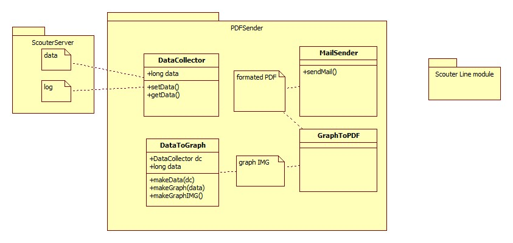

# Hanium-PdfReport (2017-07-28)
한이음 스카우터 프로젝트 PDF 생성 및 메일 전송 모듈

## Hanium-PdfReport
SCOUTER는 오픈소스 APM 도구로서 Java, WAS에 대한 모니터링 모니터링 기능을 제공하며 이 모듈은 Scouter Agent 모듈에서 수집하는 Data를 Format화 된 형태의 보고서화 하며, 이를 주 사용자에게 주기적으로 전송하기 위한다.

 - **APM** : Application performance montoring / application performance management

기업용 IT는 상용 서비스를 기반으로 진화하여 왔다. 그러나 이제는 점점 더 오픈 소스 기반의 시스템 구축이 늘어나고 있다. 오픈소스 기반의 시스템을 구축할때 성능 관리 또한 같이 고려 되어야하는데 오픈 소스인 Scouter는 가장 훌륭한 선택이 될 것이다.

-구현 되어야 하는 기능 2017-07-28
1) Scouter가 수집하는 data중 보고서에 필요한 data를 수집하기.
2) 수집한 Data를 Client가 보기 편한 자료(도표 밑 Graph)로 재 가공 하기.
3) 재 가공된 data를 보고서화하여 Client가 편한 형태로 전송(mail ,line ) 모듈 활용

 - 보고서에 포함 되어야 하는 내용 (현재)
   - Bad Query top 10 -> 웹 서비스에 있어서 transaction 처리에 있어 가장 안 좋은 response time을 갖는 query들의 list를 나타낸다.
   - 페이지 별 response time의 변화 추이 -> 페이지 별로 response time을 알 수 있는 Scouter의 기능을 활용해 서버에 안 좋은 영향을 끼칠 수 있는 response를 보이고 있는 페이지의 response time의 변화 추이를 꺾은 선 그래프로 나타낸다.
   - 서비스의 시간대별 request  현황 -> 서비스의 들어오는 request를 시간대 별로 분석해 막대 그래프로 나타낸다.

 - 모니터링 대상 (TOBE)
   - Thread 분석(Thread가 생성되어 사라지는 시간을 시각화하여 Thread의 Dead Lock현상등을 발견 할 수 있게 한다.)

